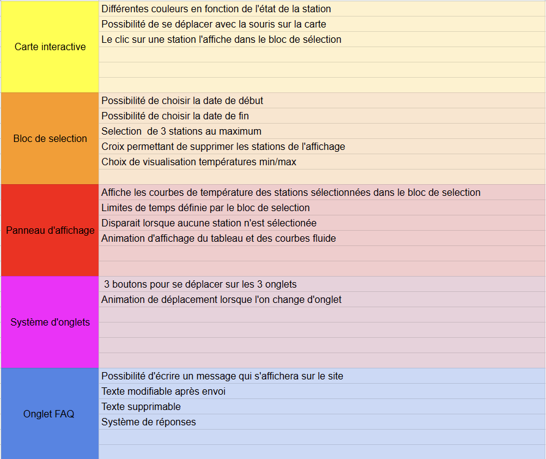

# Carte Interactive des Températures en France  
### *Projet F — Visualisation des Températures Min/Max à travers les stations météorologiques françaises*

---

## Équipe projet

| Nom                  | Rôle                                                                 |
|----------------------|----------------------------------------------------------------------|
| **Maxence CHAUMONT** | Chef de projet — Coordination, accompagnement HTML/CSS  |
| **Matéo RICHE**      | UI/UX Designer — Conception de l’interface web, gestion des styles CSS |
| **Tristan TARAUD**      | Développeur Back-End — Développement du serveur, logique API         |
| **Mathis BOURGUIGNON**| Spécialiste Base de Données — Intégration SQL, requêtes optimisées   |

---

## Objectif du projet

Développer une **application web interactive** permettant de **visualiser dynamiquement les températures minimales et maximales** mesurées par les stations météorologiques françaises, à travers une **interface cartographique** ergonomique.

## Cahier des charges

## Enjeux techniques

Le projet s’articule autour des aspects suivants :

-  **Back-end Python** avec `http.server` pour gérer les requêtes HTTP et les routes dynamiques.
-  **Base de données SQLite** contenant les valeurs de températures (`valeurs_TX`, `valeurs_TN`) et les métadonnées des stations.
-  **Serveur HTTP local** avec gestion de cache et génération de graphiques via `matplotlib`.
-  **Cartographie interactive** permettant de localiser les stations grâce à leurs coordonnées GPS.
-  **RESTful API** exposant les données de stations et les graphiques dynamiques selon la sélection utilisateur.

---

##  Flux utilisateur

1. L’utilisateur accède à une **carte de France interactive**.
2. Il **clique sur une station** (icône sur la carte).
3. Une requête est envoyée au serveur Python pour récupérer :
   - les **coordonnées de la station**
   - un **graphique dynamique** des températures min/max
4. Le graphique est **affiché dynamiquement** dans l’interface web.
5. L’utilisateur peut **choisir une période** spécifique pour affiner sa visualisation.

---

## Technologies utilisées

| Technologie   | Rôle                                         |
|---------------|----------------------------------------------|
| **Python**    | Serveur HTTP, gestion des routes             |
| **SQLite**    | Stockage des températures et stations        |
| **Matplotlib**| Génération des graphiques                    |
| **HTML/CSS**  | Structure et design de l’interface web       |
| **JavaScript**| Interaction carte / client / serveur         |

